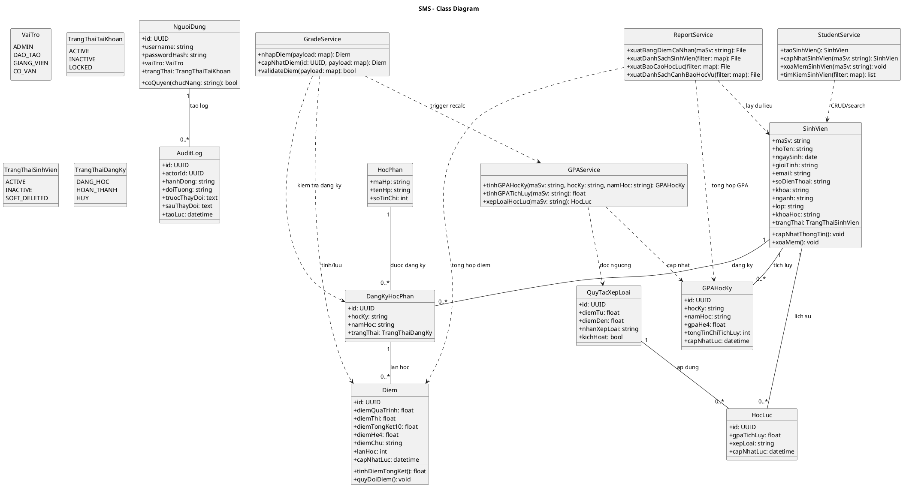
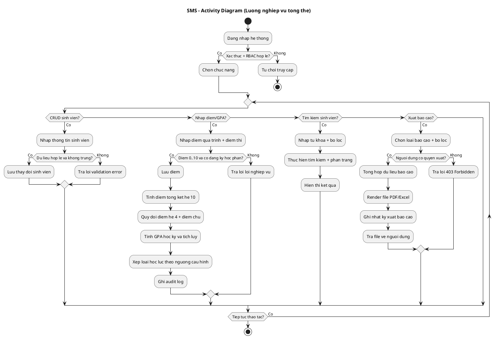
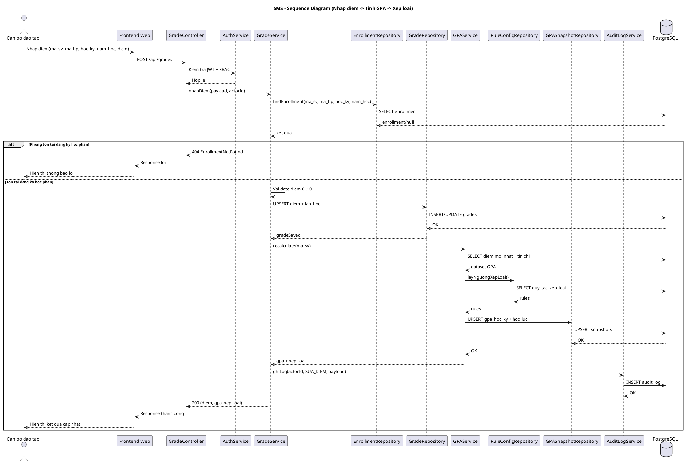

# 04 - Thiet ke UML

Tai lieu nay tong hop thiet ke UML cho he thong quan ly sinh vien.
Nguon chinh duoc luu duoi dang PlantUML trong thu muc `prod/uml`.

## 1. Danh sach file UML
- Class diagram: `prod/uml/class-diagram.puml`
- Activity diagram: `prod/uml/activity-diagram.puml`
- Sequence diagram: `prod/uml/sequence-diagram.puml`

## 2. Class Diagram (PlantUML)

## 3. Activity Diagram (PlantUML)

## 4. Sequence Diagram (PlantUML)

