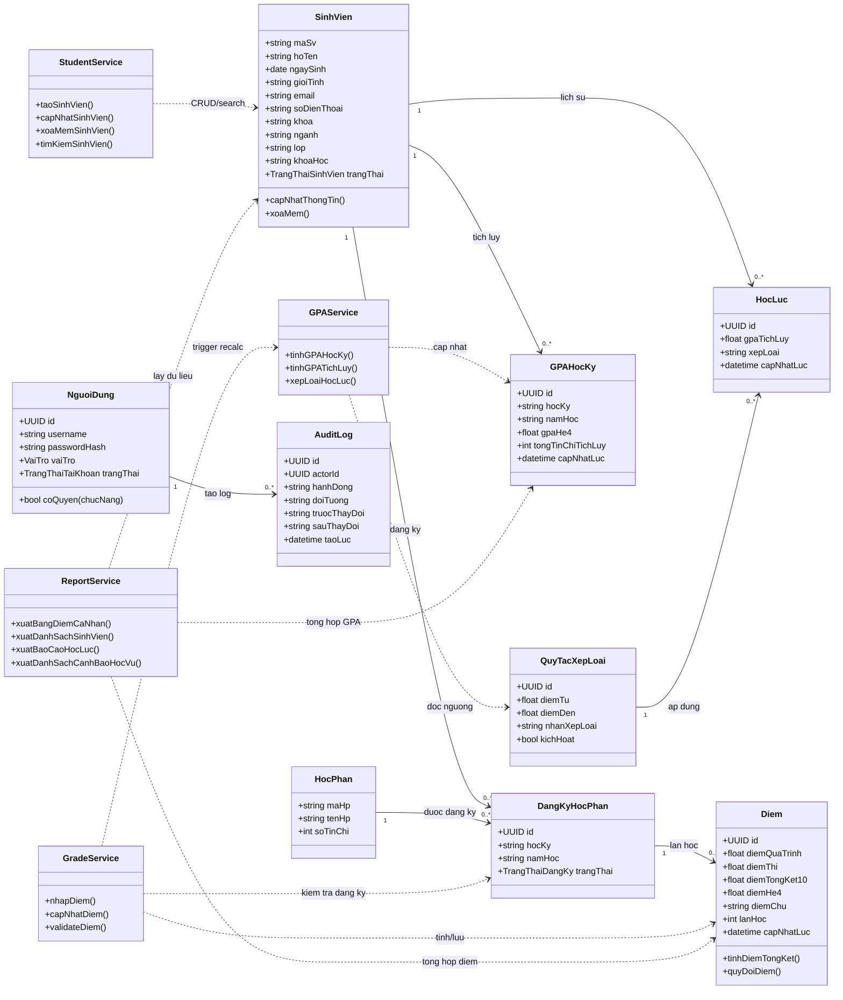
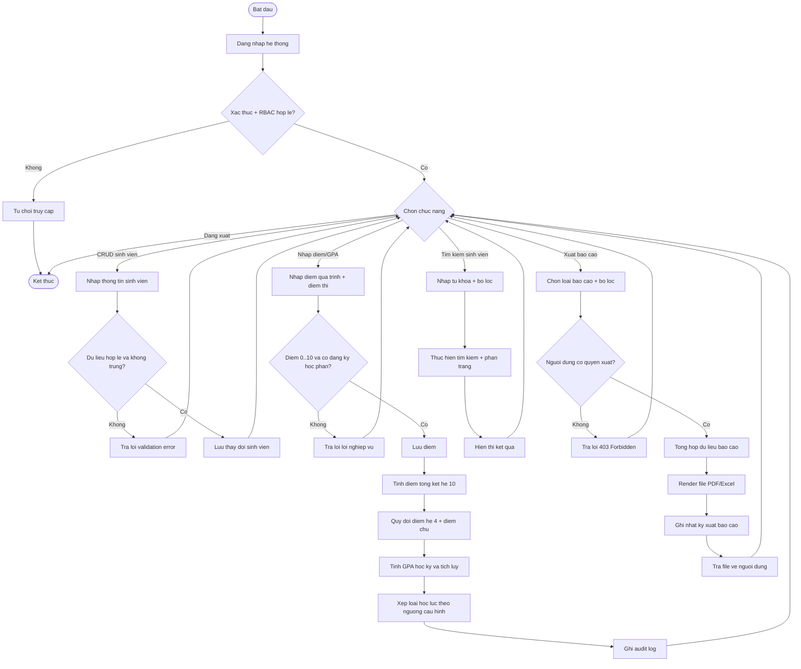
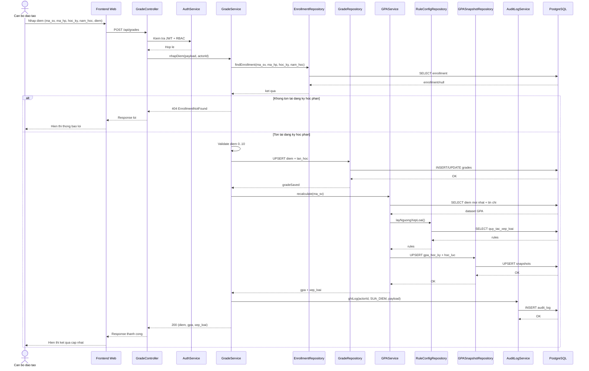

# 04 - Thiet ke UML

Tai lieu nay mo ta UML muc thiet ke co so cho pham vi MVP da thong nhat trong `03-yeu-cau-chuc-nang.md`.

## 1. Class Diagram

## 2. Activity Diagram (Luong nghiep vu tong the)

## 3. Sequence Diagram (Nhap diem -> Tinh GPA -> Xep loai)

## 4. Ghi chu su dung
- Cac so do tren duoc viet bang Mermaid de render truc tiep trong Markdown preview.
- Neu can xuat file anh/PDF UML, co the copy block Mermaid sang cong cu render de xuat.

## 5. UML code (PlantUML)
- Class diagram: `prod/uml/class-diagram.puml`
- Activity diagram: `prod/uml/activity-diagram.puml`
- Sequence diagram: `prod/uml/sequence-diagram.puml`
